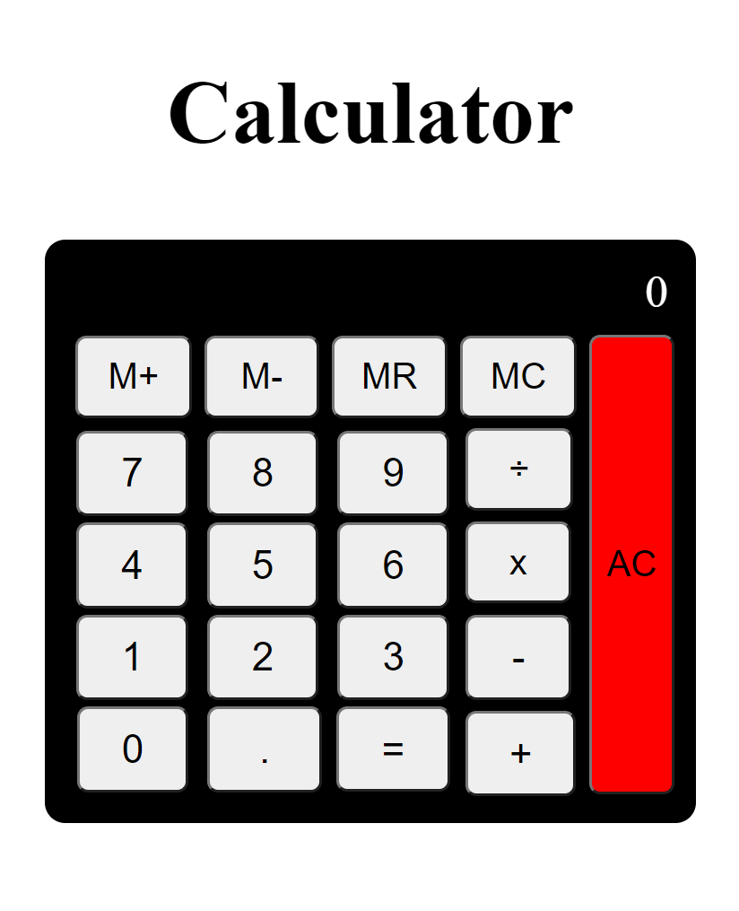

# *Calculator Application*

 This application is simply written in ***JavaScript, HTML and CSS***

 Working Version ***[here](https://komalgill0310.github.io/calculator-app-second-time-/)***

# **Summary**

Until now, this has been the most challenging application. My initial thoughts were that I could never finish it since I have never built anything so complex before. The only thing I could do was to keep going and take small steps forward. By completing this application, I have also strengthened my knowledge of passing arguments, parameters, and creating eventListeners on buttons. 

* **Tools Used:** 
  * Ternary Operator
  * If Statements
  * AddEventListener
  * Switch Statement
  * Arguments, Parameters

# Author

Komal | Software Developer | [Portfolio](https://kaurkomal.com/) | [LinkedIn](https://www.linkedin.com/in/hssa03/)
